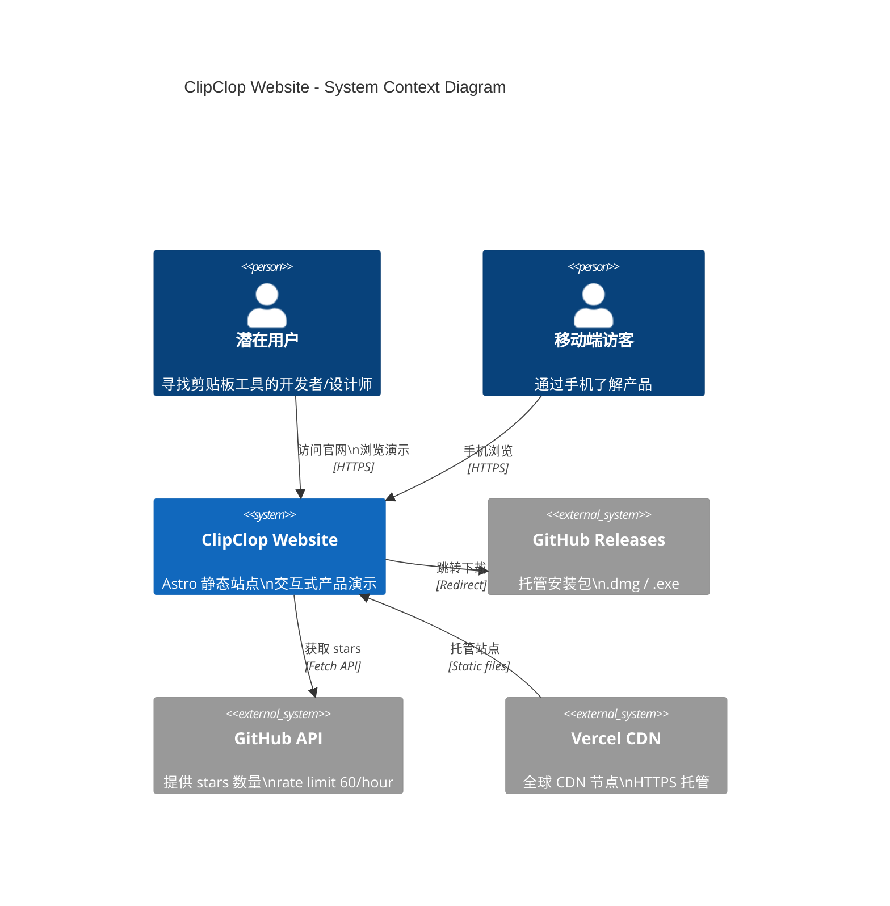
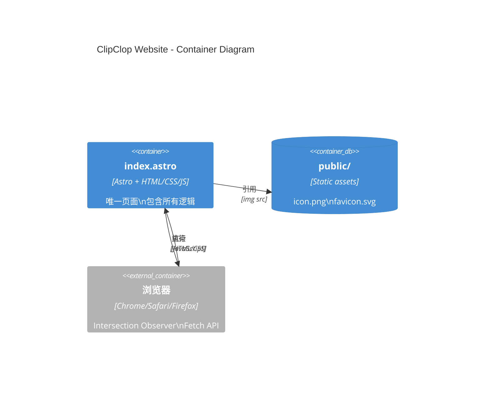
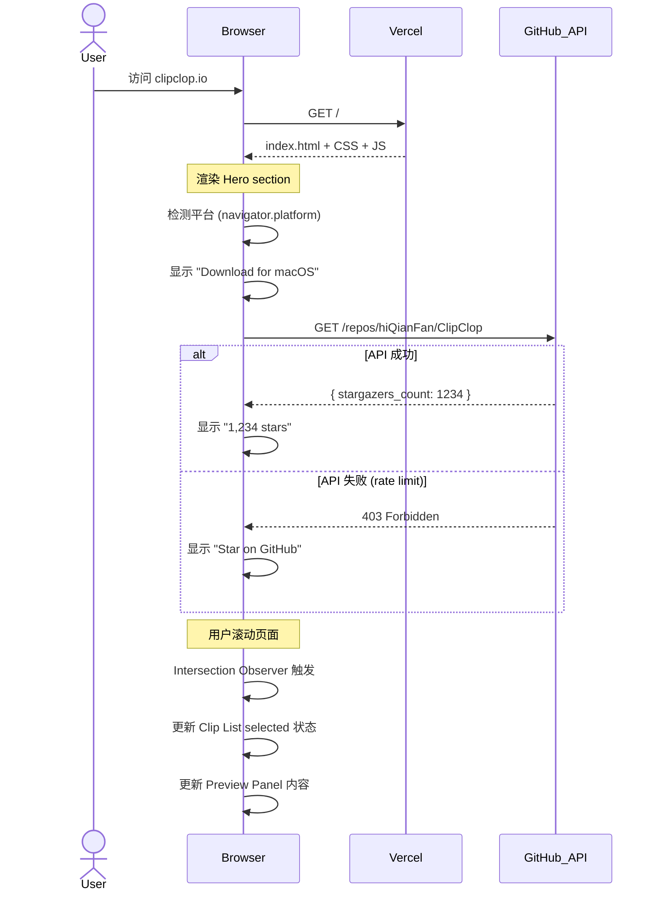
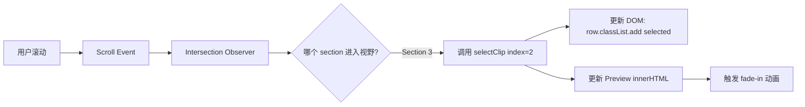
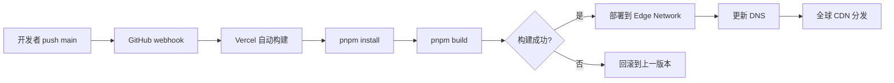

# Architecture

## Goals and quality attributes

### 核心目标

1. **沉浸式产品演示** - 让用户在浏览器中感受 ClipClop 的真实交互
2. **零摩擦下载** - 一键跳转到 GitHub Releases,无需注册或填表
3. **永久可访问** - 纯静态站点,无依赖后端服务

### 质量属性

| 属性 | 目标 | 测量方式 |
|-----|------|---------|
| **性能** | 首屏 < 1.5s, LCP < 2.5s | Lighthouse Performance > 90 |
| **可访问性** | WCAG AA 合规 | Lighthouse Accessibility > 90 |
| **可维护性** | 单文件架构,零依赖 | 总代码量 < 1000 行 |
| **可靠性** | 静态托管,99.9% 可用 | Vercel 保证 |
| **隐私** | 无第三方跟踪 | 手动审计 + 内容安全策略 |

## System context



### 外部系统依赖

| 系统 | 职责 | SLA/约束 | 失败降级 |
|-----|------|---------|---------|
| GitHub Releases | 提供 ClipClop 安装包下载 | GitHub 99.9% 可用 | N/A (核心依赖) |
| GitHub API | 提供 stars 数量 | 60 requests/hour | 显示 "Star on GitHub" 静态文案 |
| Vercel | 托管静态站点 + CDN | 99.9% 可用 | N/A (托管平台) |

## Components

### 单文件架构



### 文件结构

```
clipclop.io/
├── src/
│   └── pages/
│       └── index.astro          # 唯一页面 (~800 行)
│           ├── <style>          # 内联 CSS (~400 行)
│           ├── <body>           # HTML 结构 (~200 行)
│           └── <script>         # 交互逻辑 (~200 行)
│
├── public/
│   ├── icon.png                 # App icon (从主仓库复制)
│   ├── favicon.svg
│   └── favicon.ico
│
├── AGENTS.md                    # Agent 操作指南
├── PROJECT.md                   # 项目背景
├── architecture.md              # 本文档
└── package.json                 # 依赖: astro ^4.x
```

**单文件设计理由:**
- ✅ 无需路由,无需组件拆分
- ✅ 所有逻辑在一处,易于理解和修改
- ✅ 构建产物简单,无 code splitting 复杂度
- ❌ 缺点:文件较长(~800 行),但仍在可维护范围

## Data flow

### 页面加载流程



### 滚动交互数据流



**关键数据:**
- `clipData`: 8-10 个预定义 clips (Text/Link/Code/Color/Image/File)
- `currentIndex`: 当前选中的 clip index (0-based)
- `sections`: 所有虚拟 scroll sections 的 NodeList

**无状态管理库:**
- 所有状态存储在闭包变量中
- 使用原生 DOM API 直接更新 UI
- 无 Redux/Zustand/Pinia 等状态管理

## Runtime scenarios

### Scenario 1: 首次加载 + 滚动演示

```gherkin
GIVEN 用户访问 clipclop.io
WHEN 页面加载完成
THEN Hero section 淡入动画完成 (~800ms)
AND GitHub API 请求发起 (background)
AND Download 按钮显示 "Download for macOS"

WHEN 用户向下滚动 100vh
THEN App showcase section 进入视野
AND App panel 固定在屏幕中央 (sticky top: 80px)
AND Clip List 显示 10 个 clips, item #1 selected

WHEN 用户继续滚动 ~100vh
THEN Intersection Observer 检测到 section #2 进入视野
AND Clip List item #2 变为 selected
AND Preview Panel 内容更新为 Link 类型
AND fade-in 动画执行 (140ms)
```

### Scenario 2: 点击交互 + 搜索

```gherkin
GIVEN 用户在 App showcase section
WHEN 用户点击 Clip List 中的 item #5
THEN item #5 变为 selected
AND Preview Panel 内容更新为对应内容
AND (可选) 页面滚动到 section #5

WHEN 用户在搜索框输入 "github"
THEN Clip List 过滤,只显示包含 "github" 的 clips
AND 不匹配的 clips 设置 display: none
AND 滚动映射逻辑暂停 (搜索模式)
```

### Scenario 3: GitHub API 失败降级

```gherkin
GIVEN 用户访问官网
WHEN GitHub API 请求超时或返回 403
THEN 捕获错误,执行 .catch()
AND #starCount 元素 textContent 设置为 "Star us"
AND GitHub stats 链接仍然可用
AND 控制台无错误日志 (已处理)
```

## Deployment

### 托管架构

```mermaid
C4Deployment
    title ClipClop Website - Deployment Diagram

    Deployment_Node(vercel, "Vercel Edge Network", "Global CDN") {
        Deployment_Node(edge, "Edge Functions", "Auto-scaling") {
            Container(static, "Static Files", "HTML/CSS/JS/Images")
        }
    }
    
    Deployment_Node(dns, "DNS", "Cloudflare/Vercel DNS") {
        Container(domain, "clipclop.io", "A/CNAME record")
    }
    
    Deployment_Node(github, "GitHub", "Git hosting") {
        Container(repo, "clipclop.io repo", "Source code\nmain branch")
    }
    
    Rel(domain, vercel, "指向", "DNS")
    Rel(repo, vercel, "自动部署", "Git push")
    Rel(vercel, static, "分发", "CDN")
```

### 部署流程



### 环境配置

| 环境 | 分支 | URL | 用途 |
|-----|------|-----|------|
| Production | `main` | `clipclop.io` | 生产环境 |
| Preview | `feature/*` | `pr-123.vercel.app` | PR 预览 (可选) |
| Local | N/A | `localhost:4321` | 本地开发 |

## Cross-cutting constraints

### CC-1: 设计系统同步约束

**规则:** 网站的所有设计 tokens 必须与主仓库 `/DESIGN.md` 保持一致。

**实现:**
- 在 `index.astro` 的 `:root` CSS variables 中定义 tokens
- 每次主仓库 `DESIGN.md` 更新时,手动同步到网站
- 未来可考虑自动化: 解析 DESIGN.md YAML frontmatter → 生成 CSS

**验证:**
- 手动对比 `--bg-shell`, `--action`, `--text-1` 等颜色
- 确认 `--mono` 和 `--sans` 字体栈一致
- 确认 `--radius-*` 圆角值一致

### CC-2: 零依赖约束

**规则:** 除 Astro 外,不引入任何前端框架或 UI 库。

**理由:**
- 减少构建复杂度和包体积
- 确保网站永久可访问 (无依赖过期风险)
- 与 ClipClop "轻量、快速" 的品牌形象一致

**允许:**
- Astro (静态生成工具)
- 原生浏览器 API (Intersection Observer, Fetch)
- CSS animations (无需 GSAP/Framer Motion)

**禁止:**
- React/Vue/Svelte 组件
- Tailwind CSS / Bootstrap (手写 CSS)
- Lodash / jQuery (使用原生 JS)

### CC-3: 隐私约束

**规则:** 不嵌入任何第三方跟踪脚本。

**禁止:**
- Google Analytics
- Facebook Pixel
- Hotjar / FullStory
- Intercom / Drift

**允许 (可选):**
- Plausible / Fathom (隐私友好的分析工具)
- 需在页面底部明确告知用户

### CC-4: 浏览器兼容性约束

**目标浏览器:**
- Chrome/Edge 90+
- Firefox 88+
- Safari 14+
- iOS Safari 14+
- Chrome Android 最新版

**不支持:**
- Internet Explorer (已停止支持)
- Edge Legacy (已停止支持)
- iOS Safari < 14

**关键 API 兼容性:**
- Intersection Observer: 95%+ 浏览器支持,无需 polyfill
- Fetch API: 97%+ 浏览器支持
- CSS Variables: 96%+ 浏览器支持
- CSS Grid: 96%+ 浏览器支持

## Invariants

### INV-1: 单页架构不变量

**约束:** 整个网站只有一个 HTML 页面 (`index.astro`)。

**理由:** 
- 产品演示只需一个页面即可完整展示
- 避免引入路由复杂度
- 构建产物简单,CDN 缓存友好

**违反检测:** 如果 `src/pages/` 目录下存在 > 1 个 `.astro` 文件,则违反此约束。

### INV-2: Design tokens 映射完整性

**约束:** 主仓库 `DESIGN.md` 中定义的所有 tokens 必须在网站中有对应的 CSS variables。

**必须映射的 tokens:**
- 所有 `colors.*` (bg-shell, bg-raised, text-1, action, etc.)
- 所有 `typography.*` (heading, body, label, caption)
- 所有 `rounded.*` (sm, md, lg, xl, pill)
- 所有 `spacing.*` (1-12)

**违反检测:** 手动对比两个文件,确认无遗漏。

### INV-3: GitHub 作为下载唯一入口

**约束:** 所有下载链接必须指向 GitHub Releases,不得自建下载服务器。

**URL 格式:** `https://github.com/hiQianFan/ClipClop/releases/latest`

**理由:**
- 确保用户下载官方签名版本
- 避免维护第三方镜像的复杂度
- 与 ClipClop 开源透明的理念一致

**违反检测:** 搜索代码中所有 `href` 属性,确认无非 GitHub 的下载链接。

## Risks and technical debt

| 风险 | 影响 | 缓解措施 | 状态 |
|-----|------|---------|------|
| GitHub API rate limit | GitHub stars 无法显示 | 1. 缓存 15 分钟<br>2. 失败降级为静态文案 | ✅ 已缓解 |
| 滚动映射不流畅 | 用户体验下降 | 1. 调优 Intersection Observer threshold<br>2. 使用 `rootMargin` 预加载 | ⚠️ 需测试 |
| 单文件过长难维护 | 代码可读性下降 | 1. 保持 < 1000 行<br>2. 使用清晰的注释分隔 sections | ✅ 可控 |
| 设计 tokens 不同步 | 视觉不一致 | 1. 文档明确同步流程<br>2. 未来自动化 | ⚠️ 待自动化 |
| 移动端体验未充分测试 | 移动用户流失 | 1. 真机测试 iOS/Android<br>2. BrowserStack 云测试 | ❌ 待实施 |

### 技术债务

1. **设计 tokens 手动同步** (优先级: 中)
   - 现状: 每次主仓库更新后手动复制
   - 理想: 自动解析 `DESIGN.md` YAML frontmatter 生成 CSS
   - 工作量: ~4 小时

2. **无端到端测试** (优先级: 低)
   - 现状: 依赖手动测试
   - 理想: Playwright 自动化测试滚动交互
   - 工作量: ~8 小时

3. **单文件架构的扩展性** (优先级: 低)
   - 现状: 所有代码在一个 `.astro` 文件
   - 风险: 如果未来需要多页面 (如 Blog),需要重构
   - 决策: 暂时接受,未来需要时再拆分

## Related ADRs

暂无 ADR。如果未来出现以下重大决策,应创建 ADR:
- ADR-001: 选择 Vercel 而非 Netlify/Cloudflare Pages
- ADR-002: 采用单文件架构而非组件化
- ADR-003: 不引入前端框架的理由
